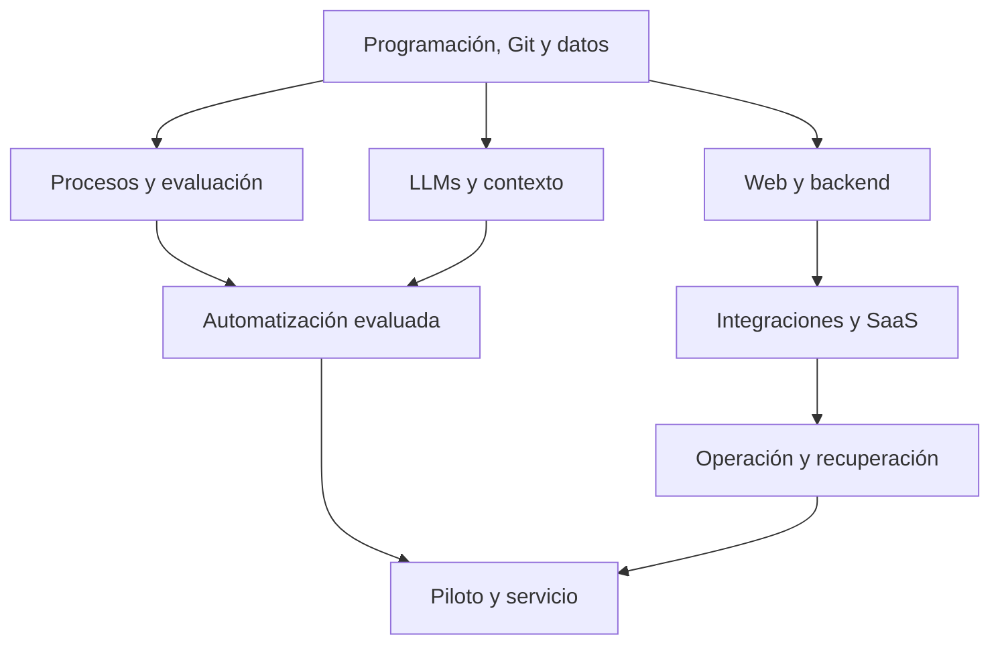

# Mapa de estudio

La [ruta personal](../02-Rutas/Mi%20ruta%20personal.md) prioriza software con IA y procesos de pymes. El [catálogo](Catalogo%20de%20modulos.md) es la referencia exacta de prerrequisitos; el dibujo agrupa capacidades y no sustituye su secuencia.

## Elegir profundidad

| Objetivo | Recorrido |
| --- | --- |
| Construir software con IA y ofrecerlo a pymes | [Ruta personal](../02-Rutas/Mi%20ruta%20personal.md) |
| Incorporar LLMs a software cuya base ya comprendés | Ruta developer o producto |
| Entrenar modelos predictivos | Ruta ML, con datos y matemáticas |
| Consultar documentos propios | Extensión RAG, después de LLMs y evaluación |
| Retomar proyectos físicos | [IA local y robótica opcional](../02-Rutas/IA%20local%20y%20robotica%20opcional.md) |
| Reproducir investigación | Ruta investigación y una subárea elegida |

Mantené un módulo principal y una sola tarea aplicada en curso. Antes de agregar una extensión, anotá el problema que resuelve y su costo de tiempo. El [Canvas](Mapa%20visual.canvas) distingue ruta principal y módulos opcionales en Obsidian.
