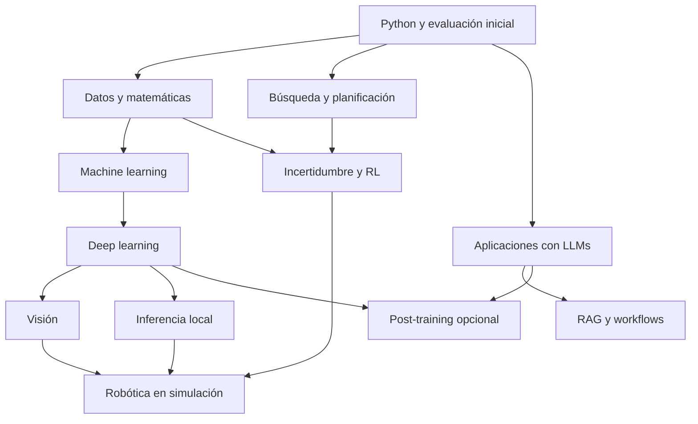

# Mapa de estudio

La [ruta personal](../02-Rutas/Mi%20ruta%20personal.md) es el camino recomendado. El [catálogo](Catalogo%20de%20modulos.md) contiene la secuencia exacta y los prerrequisitos; los números de archivo son identificadores históricos.

El diagrama muestra familias, no todos los requisitos finos. La evaluación, la depuración y el repaso atraviesan las ramas. RAG no es prerrequisito de visión, ni MCP de robótica. Fine-tuning requiere DL, familiaridad con LLMs y evaluación, no completar todos los frameworks.

## Elegir profundidad

| Objetivo | Recorrido |
| --- | --- |
| Aprender para proyectos físicos e IA local | Ruta personal |
| Automatizar una tarea con modelos existentes | Ruta developer o producto |
| Entrenar y operar modelos | Ruta ML |
| Reproducir investigación | Ruta investigación y una subárea elegida |

La elección no es permanente. Antes de cambiar, anotá qué problema nuevo justifica la rama y qué prerrequisitos faltan. El [Canvas](Mapa%20visual.canvas) ofrece una vista por áreas en Obsidian.
